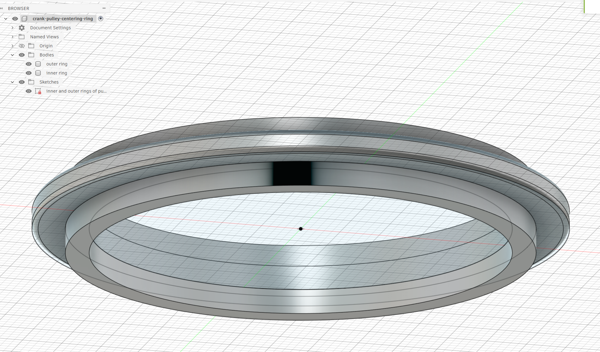
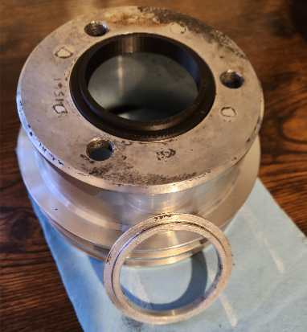
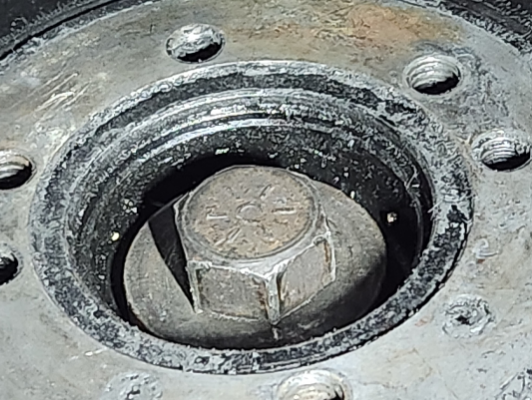
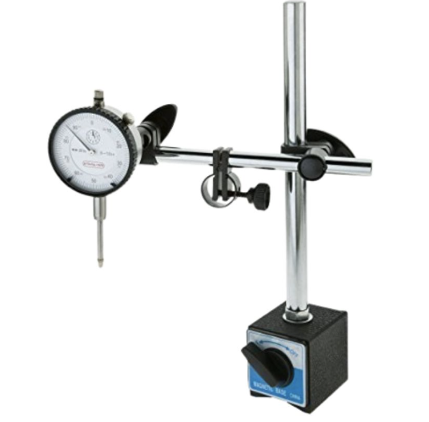

# Crank Shaft Balancer Centering Ring

## Project Description
This project documents the design and 3D printing of a centering ring for a crank shaft balancer and aftermarket pulley. The car owner installed a smaller-than-original performance pulley and balancer, then found the new assembly would not fit together with the centering ring.

Use of a dial indicator displayed a 0.05" wobble before the centering ring was installed. After installing the printed ring, the wobble was reduced by 0.04" while turning the engine, demonstrating that the ring improved alignment. There is still a slight wobble, however it is greadtly reduced from before.

The part was printed with slim tree supports. Those supports left residue on one side of the outer ring, so the face is no longer perfectly flush. Additional support, cleanup experiments, and testing fillet angles are planned.

## Gallery

### Timelapse

  

    
  

  

    
  

### Model & Fitment

  

    
  

  

    
  

  

    
  

### Tools

  

    
    
Digital Caliper

  

  

    
    
Feeler Gauge

  

  

    
    
Dial Indicator

  

## Measurements and Calculations
The following image details the precision measurements taken with calipers and feeler gauges to spec out the centering ring and determine the exact thickness required to be added to the 3D printed part to ensure a perfect sandwich fit between the balancer and the pulley.

| Item | (mm) | Tool | Notes |
|---|---:|---|---|
| Pulley outer ring diameter | 65.96 | Caliper lower jaws | Twisted and measured by spinning inside jaws for accurate reading |
| Pulley inner ring diameter | 51.92 | Caliper upper jaws | Twisted and measured by spinning ooutside jaws for accurate reading |
| Balancer inner ring depth | 2.79 | Feeler Gauge | Depth from balancer outer ring flange to depth limit from crank shaft |
| Balancer outer ring depth | 1.05 | Feeler Gauge | Depth from balancer face to flange |
| Pulley inner ring depth | 2.993 | Caliper depth rod | Depth of pulley mating surface |
| Pulley outer ring depth | 2.993 | Average calculation using caliper | Depth of pulley outer ring |
| Total Depth | 8.07 | Calculation | Target combined thickness for flush fit |

Raw data and tabulated measurements: [measurements-and-calculations.csv](measurements-and-calculations.csv)

## Files
- [crank-pulley-centering-ring.stl](crank-pulley-centering-ring.stl) - The final 3D printable model.
- [centering-ring-f360.png](centering-ring-f360.png) - Screenshot of the model in Fusion 360.
- [centering-ring-3d-printed-with-supports.gif](centering-ring-3d-printed-with-supports.gif) - Animated timelapse of the 3D printing process.
- [accessory-belt-on-pulley.gif](accessory-belt-on-pulley.gif) - Animated view of the accessory belt on the pulley.
- [3d-printed-centering-ring-fit-in-pulley.png](3d-printed-centering-ring-fit-in-pulley.png) - Verification of the ring fitting into the pulley.
- [digital-caliper.png](digital-caliper.png) - Digital caliper used for precision measurements.
- [feeler-gauge.png](feeler-gauge.png) - Feeler gauge used for measuring depth.
- [balancer-depth-measured-with-feeler-gauge.png](balancer-depth-measured-with-feeler-gauge.png) - Measurement of the balancer depth.
- [measurements-and-calculations.png](measurements-and-calculations.png) - Summary of all measurements and calculations.